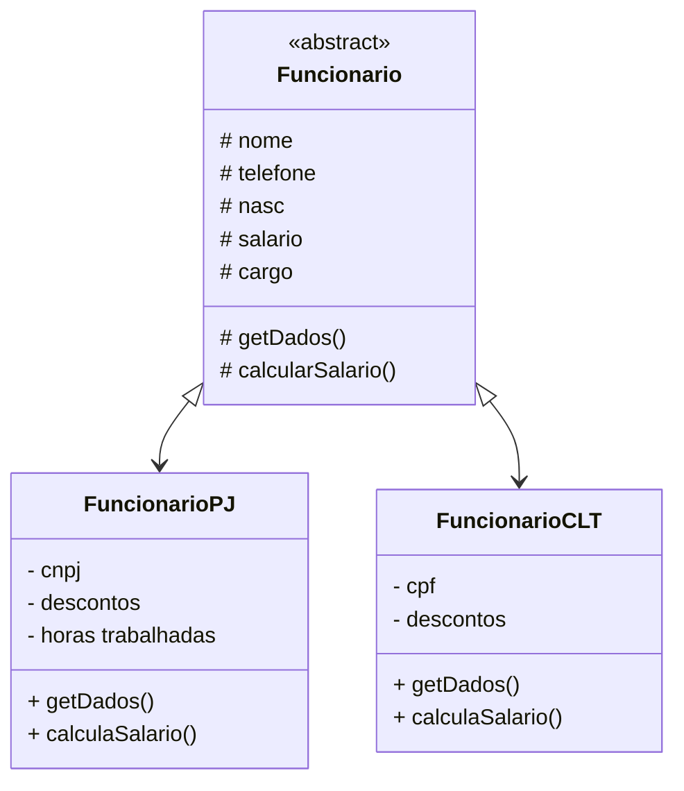

```mermaid
classDiagram
Funcionario <|--> FuncionarioPJ
Funcionario <|--> FuncionarioCLT

class Funcionario{
    <<abstract>>
    # nome
    # telefone
    # nasc
    # salario
    # cargo


    # getDados()
    # calcularSalario()
}
class FuncionarioCLT{
    - cpf
    - descontos

    + getDados()
    + calculaSalario()
}
class FuncionarioPJ{
    - cnpj
    - descontos
    - horas trabalhadas

    + getDados()
    + calculaSalario()
}

```