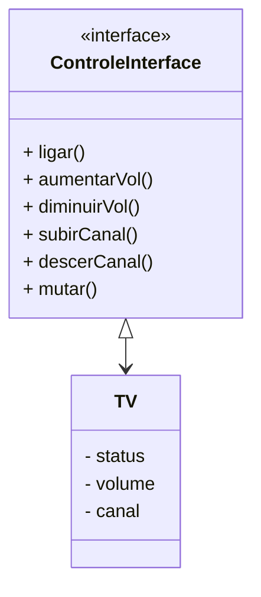

```mermaid
classDiagram
ControleInterface <|--> TV
class ControleInterface{
    <<interface>>
    + ligar()
    + aumentarVol()
    + diminuirVol()
    + subirCanal()
    + descerCanal()
    + mutar()
}
class TV{
    - status
    - volume
    - canal
}

```